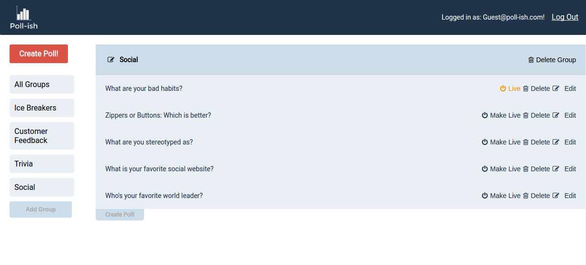

#Poll-ish

[Poll-ish live](http://www.poll-ish.us)

Poll-ish is a full-stack web app that allows users to create and organize polls and then monitor the poll results in real time as an audience responds. The backend is Ruby on Rails using a PostgreSQL database, and the frontend is done in [React](https://facebook.github.io/react/) and [Redux](https://github.com/reactjs/redux).

##Features & Implementation
###Single-Page Design

Poll-ish delivers all of it's content on a single page to make user interaction simple and intuitive. The `SessionReducer` ensures a single `currentUser` object is held or discarded from front-end state upon successfull login or logout and pertinent information is only rendered when logged in. Account specific poll data is only sent from the server after a successful username and password validation from an API call to the `SessionsController` which uses [BCrypt](https://www.npmjs.com/package/bcrypt) to create the  password digests stored on the server.

###Poll and Group Creation and Editing

The database has a `groups` table containing columns for `id`, `name`, and `user_id`.

Groups are intended as a way for users to organize their polls but are made mandatory because the `polls` table validates for presence of a group.

The database stores Polls across 3 separate tables: `pollishes`, `questions`, and `answers`. `pollishes` has columns for `id`, `group-id`, and `live`. `questions` has columns for `id`, `body`, and `pollish_id`. `answers` has columns for `id`, `body`, `question_id`, and `votes`.

Upon login, separate API calls are made to the `GroupsController` and `PollishesController` which respectively search the database for all groups and polls belonging to the current user (polls have a single user through the groups table which contains a `user_id` column). The `GroupReducer` and `PollReducer` ensure that the frontend state contains objects holding the group and poll information under the `groups` and `polls` keys.

Group info is rendered separately in two different components: the `GroupSidebarItem` and the `GroupItem` which are placed in the `Sidebar` and `MainPanel` components respectively. Editing of groups is allowed through onClick events implemented on the `GroupItem` component and adding new groups is achieved through onClick events implemented in the `Sidebar`. The layout can be seen below:



Adding and editing polls is achieved through the `PollForm` component which makes the appropriate API calls to the `PollishesController`. This is housed in both the `SidePanel` and in each `GroupItem` so that adding a poll from the sidebar will default polls to an "Ungrouped" group whereas adding a poll via the `GroupItem`'s "Add Poll" button adds the poll directly to the attached group.


Polls' CRUD features are activated in `PollItem` components and `PollChart` components display the poll results graphically using [react-google-charts](https://github.com/RakanNimer/react-google-charts).


A single poll can be live at a time, which is achieved on the backend in the `PollishesController` which implements an `ensure_single_live` method when polls are edited or added. Toggling the live status of a poll is achieved through onClick events in `PollItem`s. Polls can be moved between groups by dragging from one group to another which was implemented with drag and drop events in the `PollItem` and `GroupItem` components respectively.

###Voting on Polls and Live Updating

Each user is given a single voting page located at `/user/#/:id`. Rendering of the `VoteForm` at this url does not require authentication, allowing the maker of a poll to send the link out to audience members who can take the poll without impediment.

The `VoteForm` gains access to the user's current live poll by making an API call to the UsersController which searches the database for the single poll connected to the user id from params which also contains a truthy live status. The 'VotesReducer' stores this poll object under the `votes` key in the frontend state. The `VoteForm` component renders the relevant question and answer choices and `onSubmit` it makes an API call to `PollishesController` to update the vote count accordingly. The success callback of the API call changes the `votes` key in state to "completed" which triggers setting a cookie on the user's browser tracking the id of the completed poll to the string "completed". The `VoteForm` will not allow users to vote again on the same poll so long as the cookie contains the completed status for the id of the relevant poll.

The `PollishesController`'s update function utilizes a websocket publishing an event with [Pusher](https://github.com/pusher) on a channel linked to the poll's id.

```
if poll_params[:place_vote]
  answer = Answer.find_by_id(poll_params[:answer_id])
  answer.votes += 1
  if answer.save
      Pusher.trigger('poll_' + @poll.id.to_s, 'vote_added', {
        poll_id: @poll.id,
        vote_for: answer.body
      })
      render :show
  else
    render json: answer.errors.full_messages
  end
end
```

This allows each `PollItem` to listen on the appropriate channel and when it notices a change was made, it sends an API request get an updated copy of the relevant poll.

```
componentDidMount(){
  var pusher = new Pusher('XXXXXXXXXXXXX', {
   encrypted: true
 });
 let that = this
 var channel = pusher.subscribe('poll_' + this.props.poll.id);
 channel.bind('vote_added', function(data) {
   that.props.requestSinglePoll(data.poll_id);
 });
}
```
